LCE(linuxcon europe)报告
--------------------
<http://hi.ktsee.com/383.html>: `pandoc -f markdown -t html ./report.md | pandoc -f html -t docx -o report.docx`

这个第一次参加Linuxcon europe, 总体来说内核相关的开发议题比较少, 需要认真做好功课. 下面先会分享两个感激有价值的议题. 另外suse两个maintainer的交流内核, 最后是其它参会笔记.

# memory barrier
用于linux kernel memory barrier分析的工具: "Linux-Kernel Memory Ordering: Help Arrives At Last!".
作者是"Paul E. McKenney" <paulmck@linux.vnet.ibm.com>, 内核RCU的maintainer.

1.  演讲首先提出问题: 对于memory barrier来说, 内核提供的唯一文档就是"Documentation/memory-barriers.txt", 而且这个文档还不全, 对于一般开发来说用对memory barrier并不是一件容易的事情.
2.  作者指出memory barrier测试需要考虑编译器和硬件能力(工具明确支持armv8的硬件行为)等多个因素. 工具是用OCaml写成的. 对于不懂OCaml的我来说, 可能只能使用, 难以更深入.
3.  演讲以两个竟态实例说明了分析方法, demo了运行结果.
    我看了下工具的主页<http://diy.inria.fr/doc/index.html>, 上面有详细的文档, 看到工具是支持交叉编译的(文档中以arm为例).
4.  结论: 这个工具对于内核开发中锁的检查很有帮助, 建议把这个工具用起来.
5.  进一步的思考: 能不能用其它锁的验证? 例如我司的其他分布式系统?

# 非易失性存储
围绕非易失性存储如果作为系统内存如何使用展开:

1.  "Persistent memory usage within Linux environment". Intel
    1.  基于Intel的3D XPoint.
    2.  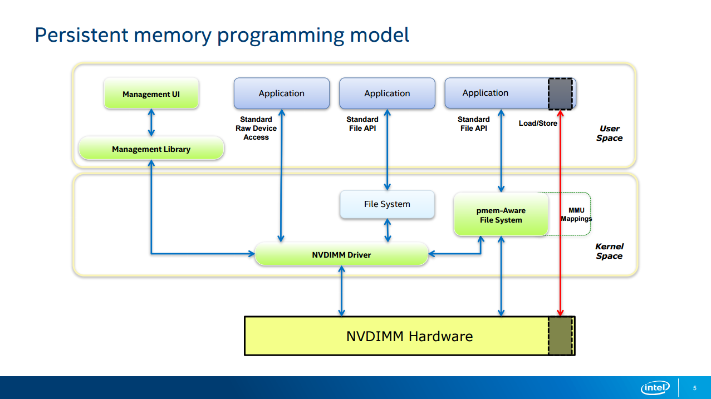
    3.  胶片介绍了内存和Storage如何使用pmem.
        1.  内存分配，通过libvmmalloc, libvmem分配堆内存，通过memkind管理不同的堆。libvmmalloc, libvmem和memkind都基于jemalloc.
        2.  storage: 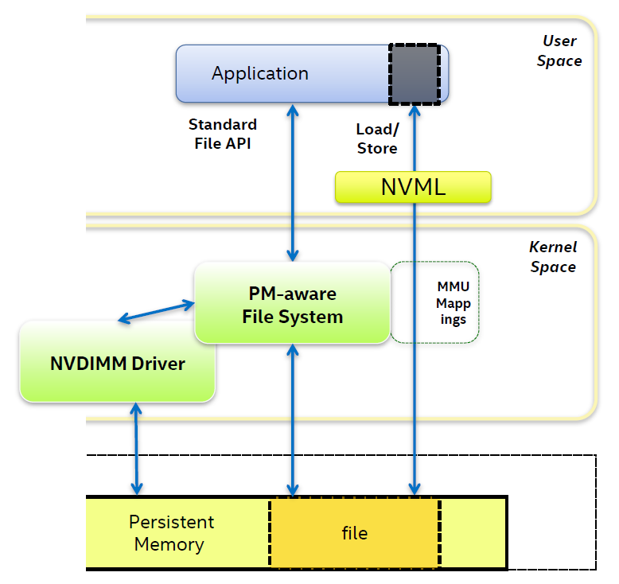
    4.  胶片最后介绍了各种benchmark，包括redis的性能，下图是当内存不足时性能情况，可以看到只有pmem可以做到性能没有跳水。
         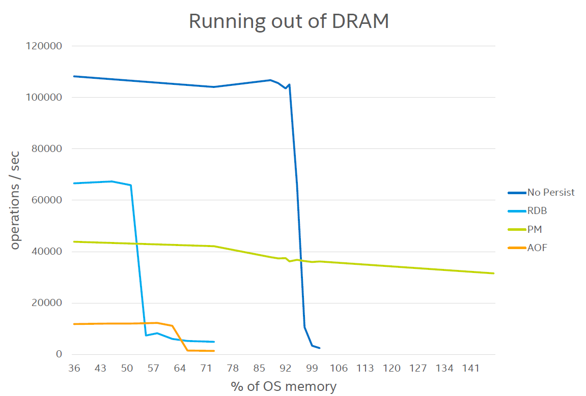
2.  pmem workshop: 介绍了pmem各种用户接口的用法，包括pmempool, pmemblkpool. TODO: mempool本来是做什么用的?
    1.  pmem_mmap_file后需要pmem_persist持久化，由于没有听这个session不清楚是为什么。根据下文看，应该是因为系统cache导致的数据不一致问题。pmemcheck可以帮忙检查没有持久化或其他问题.
3.  persistent memory semantics in programming languages, overview of the ongoing research
    1.  主要是比较已有的各种使用pmem的方法，涉及到实现复杂度，是否保证了一致性等方面
    2.  比较有没有pmem的软件栈: 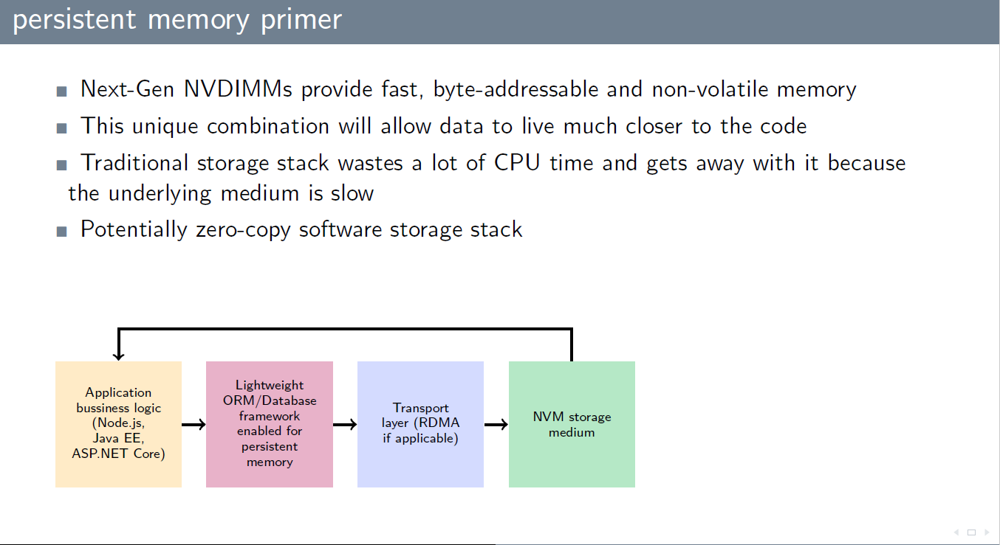, 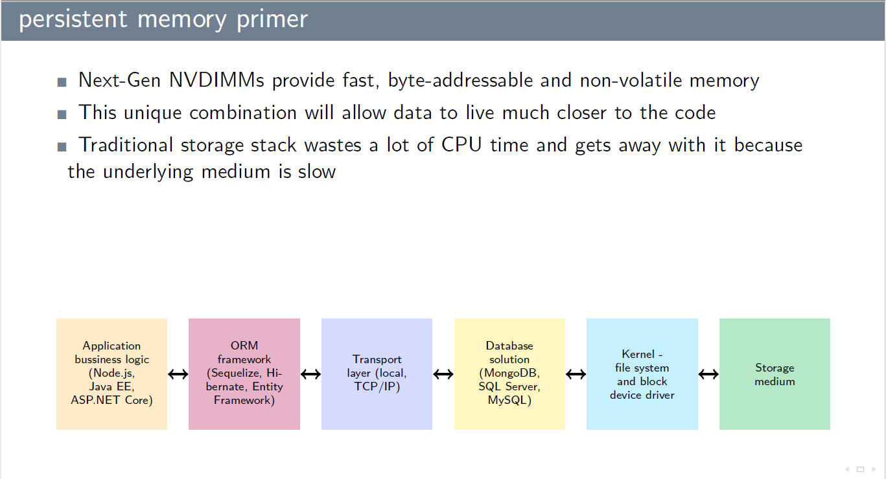
    3.  受到系统cache/buffer同步的影响，pmem数据一致性需要api保证，参考断电实验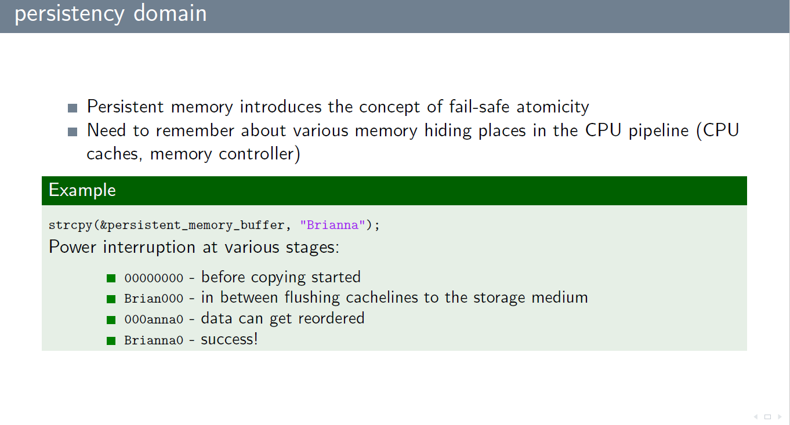, 所以libc里面直接使用pmem也是有风险的, 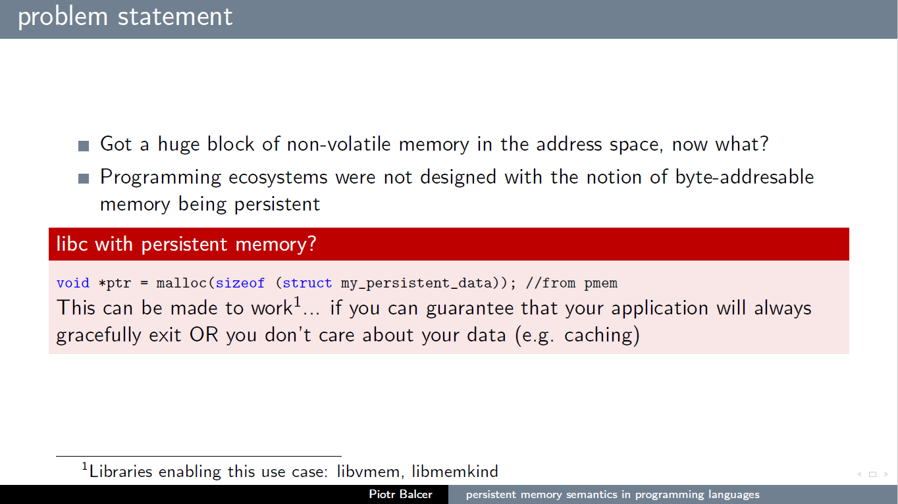
4.  persistent memory extensions to libstdc++/libc++
    介绍了pmem与c++特性如何结合.

# ask maintainer/expert
这次LCE有个环节是"ask maintainer/expert", 会安排15分钟和maintainer交流的机会(如果没有下一个人,其实可以交流更长时间). 和suse的alex graf, jiri kosina交流, 想和gregkh交流没找到时间.

1.  和Alex graf重点讨论了ILP32, 页表两个问题.
    1.  ILP32: 根据之前的讨论华为可以提供D03用于suse在obs上提供ILP32 build.
        Alex现场给我看了obs上arm64构建负载比较重, 没法在加入ILP32 build. 目前D03多次起停虚拟机上虚拟机会hang. hanjun帮忙联系了Shameerali Kolothum Thodi, Shameerali暂时没法复现alex说的问题. 后续继续交流.
        Alex还问到Huawei有没有可能用到suse商业支持的ILP32, 我说目前基于定制的文件系统暂时永不到, 将来其它产品不清楚.
    2.  和Alex讨论了suse为什么时候4k页表而不使用64k页表, Alex表示64k页表内存消耗比较大, 如果系统中启动多个虚拟机, 总体内存用量会增大. 间接提高了系统成本. 另外64k对性能改善是分场景的. 所以suse暂时用的是4k.
        个人感觉是如果能在4k页表上把cont page hint用起来, 性能比较好的话, suse会感兴趣的.

2.  和suse libs的jiri kosina交流, jiri会host LPC上living patch的讨论, jiri是suse其中内核团队(共两个)leader, 他有个兄弟在做热补丁的工作(包括内核和编译器), 个人感觉可以和jiri提前接触下, 保证得到预期结果.
    jiri的邮箱是<jiri.kosina@suse.com>

# 和欧研交流
    欧研较多工程师来参加linuxcon, 和Pradeep, Dogdan Nicolae一起讨论了memory和存储的一些问题.
    Pradeep提到IO NUMA, 把IO请求调度给临近的cpu处理, 感觉对于我司的芯片场景很有帮助.

# 自己的演讲(syscall unit test)
听众的问题:
1.  有没有做符号一致性的校验.
2.   有没有做coverage.

# 有趣的session
1.  OpenQA
    和richard brown简单聊了下openQA, 由于时间关系没法去听session. openQA已经和suse开发流程很好的结合了
    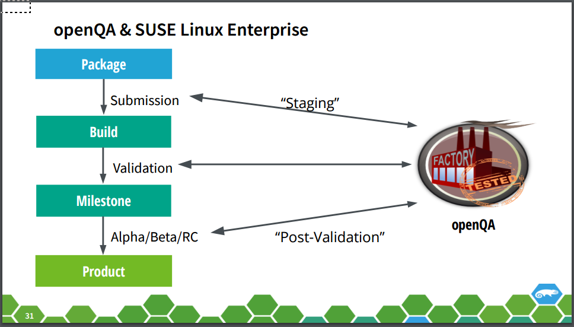
    原来以为openQA只是用openCV抓图比较图片，其实现在也可以抓串口数据。
    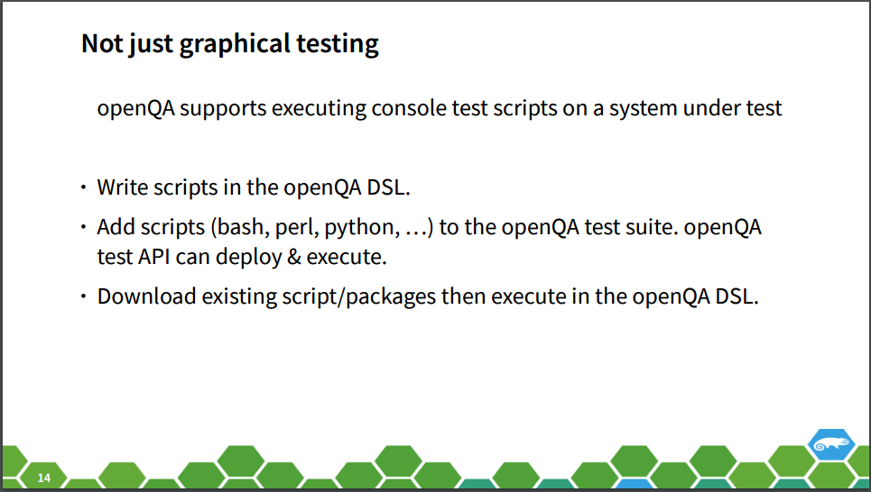
    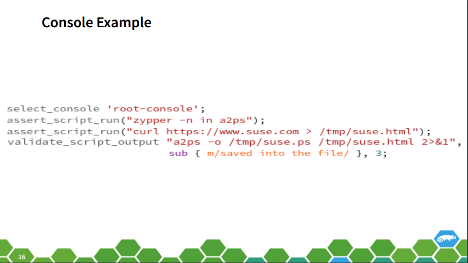
    openQA支持aarch64, x86等架构，也符合我司的应用场景：
    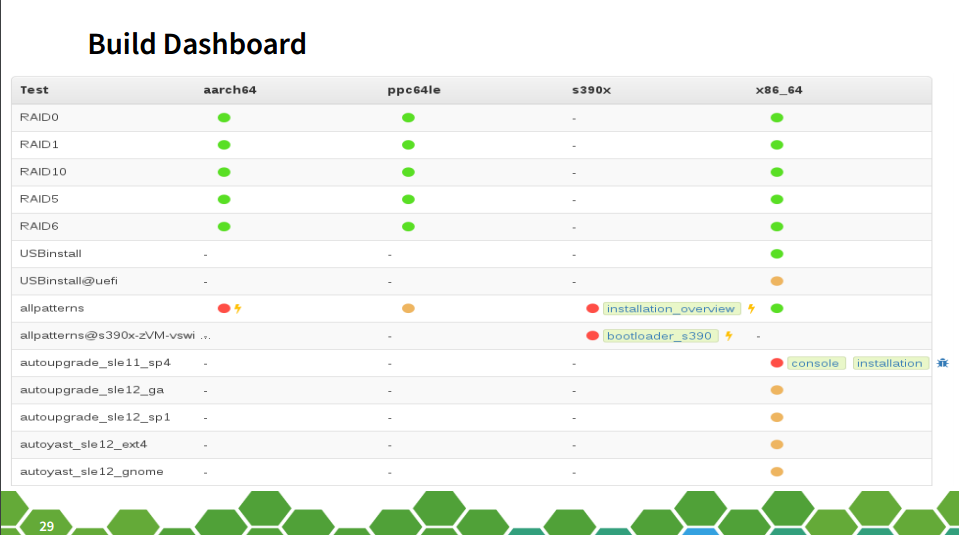
    基本来说suse所有产品，opensuse，fedora都使用openQA用于测试.
    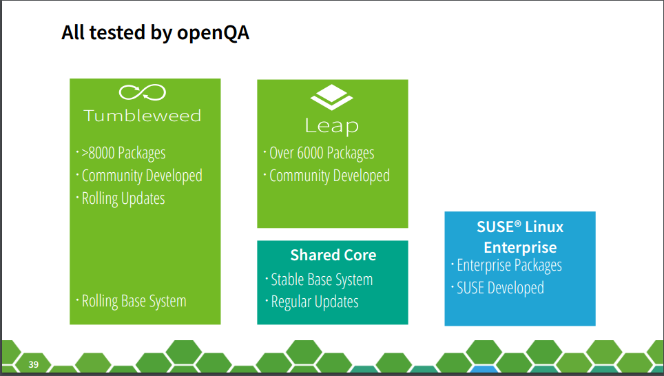
    问了下suse北京的jiangyifan，他说suse所有的自动化用例都加进去了。只有个别UI用例还是手动的。强烈建议做发行版的童鞋关注(郑博已经转给了eulerOS群)。
    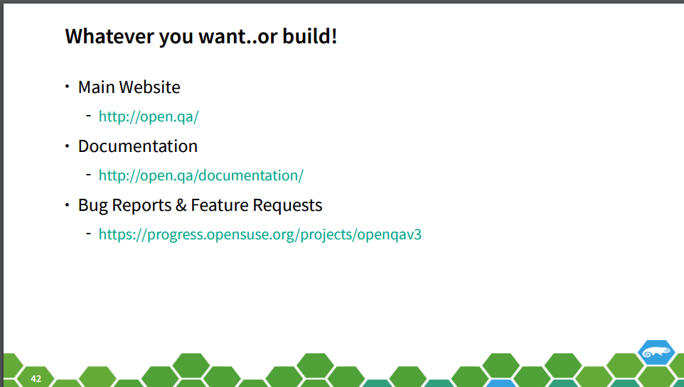

2.  unikernel introduction and demo. by Amir Chaudhry(docker)

    *   作为docker跑unikernel的micro service。
    *   demo on cubieboard2.
    *   demo中提到了部署到了IoT领域，但是demo其实是部署到了Cortex-A7, 所以指的是IoT gateway?
    *   amir认为unikernel已经可用了，就像早期汽车一样，用户需要有比较多的知识。
    *   由于unikernel基于xen的前后端驱动，这样microservice本身和具体硬件是无关的(unikernel在domU，在dom0提供驱动)。现在docker也不希望unikernel和xen绑定，在做kvm的移植，也在做非hypervisor的用法。

3.  区块链
    *   这次linuxcon关于区块链(blockchain，简单说就是一种分布式数据库)的有三个talk。今天早晨开场就是linux基金会项目之一的hyperledger项目，采用Apache协议v2，之前一直认为linux基金会项目都是gpl协议的:p
    *   hyperledger并不是要提供hypercoin，而是要作为基础设施。类比一下如今的互联网，有全球公网也有大量私有网络，但是这些网络的用到的技术基本是一样的，hyperledgeer希望成为blockchain的基础设置。
    *   项目网页：www.hyperledger.org

# 其他session:
1.  keynote: Welcome & Open Remarks(linux foundation):

    There are 38 million projects in github. It is huge number than I could imagine

2.  keynote2 docker

    *   There are 6 billion pull in 2016 from docker hub.
    *   DEMO: service cluster(docker service create) in amazon. "docker service" is introduced in 1.12.
    *   docker use EC2 and IAM(key management?).
    *   open source infrakit in this presentation.

3.  keynote3 SDS huawei
    字体太小, 后面观众可能看不清楚. linuxcon有个openSDS panel discussion, 包括dell, EMC, huawei, intel等公司. 时间关系没去听.

4.  keynote5: intel vm and container
    主要讲的是intel clear container, 我司童鞋安全容器的演讲中比较了clear container和安全容器技术的区别.

5.  session: kernel regression
    作者做了4.7和4.8内核regression管理工作. 主要是面向一般用户讲什么是regresstion，和bug有什么区别。如何判断是否是regression。如何报告regression。

6.  Linaro Alex shi: 介绍内核补丁回合方法和技巧, 里面涉及到的git用法觉得可以给大家科普下.

# 其它交流
除了session，也和新认识一些人。比如Wolfram Sang(I2C, MMC maintainer), redhat的Christoph Gorn, 东芝的Toshitake Kobayashi(他们的文件系统使用bitbake(yocto)构建， 也会用到debian https://github.com/meta-debian/meta-debian, 我建议他和linaro的open embedded比较下), hyper的张磊(k8s maintainer).
和前东家suse的一些同事也有交流，例如Lars M B现在做suse storage, 不管HA了。

# 未整理的内容
*  kernel backport, alex shi
Lots of useful command for backporting kernel feature.
1.  the difference between git log -S and -G
       -G<regex>
           Look for differences whose patch text contains added/removed lines that match <regex>.

           To illustrate the difference between -S<regex> --pickaxe-regex and -G<regex>, consider a commit with the following diff in
           the same file:
               +    return !regexec(regexp, two->ptr, 1, &regmatch, 0);
               ...
               -    hit = !regexec(regexp, mf2.ptr, 1, &regmatch, 0);

           While git log -G"regexec\(regexp" will show this commit, git log -S"regexec\(regexp" --pickaxe-regex will not (because the
           number of occurrences of that string did not change).

华为同事交流:
rtos huangjianhui是来看容器相关的。libos想给各产品线部分组建先用起来，然后普及。

其他
这次linuxcon， rtos的开发代表。eulerOS的部长和规划都来了。
自己感觉华为还是比较重视参会的，希望从会议上多了解信息。

rtos这次来了三个人，huangjianhui，刘洋，陶喆
陶喆：负责libos里面网络部分，讨论了arm虚拟化情况下hypervisor注入中断到host，guest会不会有什么区别。TODO这个shannon讨论下。
我把yongjun介绍给了陶喆。

Modularizing Fedora
https://lwn.net/Articles/679697/

日本

NFV: lunch and learn
标准部周楠有人投入到NFV组织，参与项目管理。

fd.io
http://www.metaswitch.com/the-switch/fd.io-takes-over-vpp

odp

和agraf讨论cont page hint，alex认为只是tlb miss有帮助，invalidate tlb没有帮助，不管有没有hint，都需要按4k去invalidate，我今天查了armv8 arm，的确如此。
cont page hint for tlb
Setting this bit to 1 means that the TLB can cache a single entry to cover the contiguous translation table entries.
This section defines the requirements for programming the Contiguous bit. Possible translation table registers
programming errors on page D4-1681 describes the effect of not meeting these requirements.
The architecture does not require a PE to cache TLB entries in this way. To avoid TLB coherency issues, any TLB
maintenance by address must not assume any optimization of the TLB tables that might result from use of the
Contiguous bit.
TLB maintenance must be performed based on the size of the underlying translation table entries, to avoid TLB
coherency issues.

TODO check the ingored fieild(I should read the architecture doc)
IGNORED fields
In the VMSAv8-64 translation table descriptors, the following fields are identified as IGNORED , meaning the
architecture guarantees that a PE makes no use of these fields:
•
In the stage 1 table descriptors, bits[58:52].
•
In the stage 1 and stage 2 block and page descriptors, bits[63:59] and bits[58:55].
Of these fields:
• In the stage 1 and stage 2 block and page descriptors, bits[58:55] are reserved for software use, see Field
reserved for software use.
• In the stage 2 block and page descriptors, bits[63:60] are reserved for use by a System MMU control.
Field reserved for software use
The architecture reserves a 4-bit IGNORED field in the Block and Page table descriptors, bits[58:55], for software
use. The definition of IGNORED means the architecture guarantees that hardware makes no use of this field.
Note
This means there is no need to invalidate the TLB if these bits are changed.

Using seccomp to Limit the kernel attack surface

